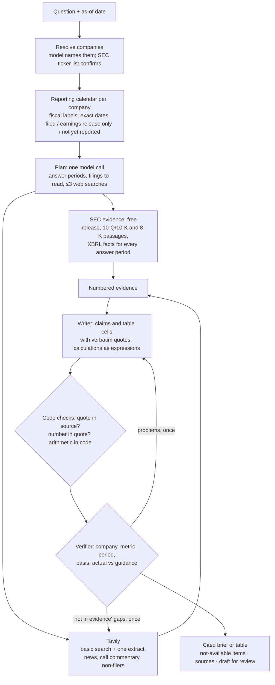

# Cited financial research agent (Tavily + SEC EDGAR)

**Links:** [live chat app](https://3-143-102-144.sslip.io) (shared-password sign-in) · [kanban](https://github.com/users/laasyaaprasad/projects/3) · [technical statement and report](REPORT.md)

An agent for financial analysts researching SEC-reporting companies. It answers questions, and builds comps and trend tables, about:
- reported results
- calculations over them
- guidance and management commentary
- recent developments

**How it works:**
- **Sources:** every number is quoted from a filing or release, or computed in code from quoted inputs.
- **Checks:** every claim is checked against its source before the answer is shown.
- **Refusals:** anything it can't support is refused explicitly instead of estimated.

It replaces the starter (a LangChain agent with one Tavily search tool on Kimi K2.6) with a fixed pipeline modeled on production finance agents, running on DeepSeek V4.1 Flash. It uses SEC filings first and Tavily for what filings can't give.

## Results

Measured on **Exact50**: 50 held-out questions on what an analyst tool has to get right. They cover ambiguous and edge-case requests, web-dependent questions (earnings-call commentary, recent events, foreign and private companies), date traps, actual versus guidance, and comparisons across fiscal calendars. Each column is one fresh run of all 50, graded by GPT-6 Luna (OpenAI, high reasoning, a different model family from the agents) with three votes per answer.

| Measure | Starter as shipped (Kimi K2.6) | Starter design on our model | **Our agent** |
|---|---|---|---|
| Fully correct | 14/50 | 25/50 | **32/50** |
| Mean rubric score | 0.66 | 0.80 | **0.89** |
| **Verified-correct**: correct, every cited claim supported, every number cited | 2/50 | 0/50 | **18/50** |
| Cited claims supported by the cited source | 66% | 69% | **94%** |
| Cited sources that are primary (SEC or company) | 15% | 26% | **73%** |
| Tavily credits (all 50 questions) | 373 | 338 | **115** |
| Cost per question (model + Tavily)\* | $0.126 | $0.074 | **$0.049** |
| Tokens per question | 58k | 60k | 63k |
| Median latency | 26 s | **12 s** | 45 s |

| Fully correct, by question class | Starter as shipped | Starter design on our model | **Our agent** |
|---|---|---|---|
| Edge and ambiguous (16) | 1 | 1 | **11** |
| Traps: point-in-time, superseded, unreported, deregistered (16) | 6 | **10** | **10** |
| Web-dependent (10) | 3 | **7** | 3 |
| Actual versus guidance (4) | 3 | 3 | **4** |
| Comparisons across fiscal calendars (4) | 1 | **4** | **4** |

The middle column runs the starter's prompt, Tavily tool and agent loop on our model. It separates what the architecture contributes from what the model contributes.

\* Model tokens at Nebius list prices (`agents/pricing.py`) plus Tavily credits at the $0.008 pay-as-you-go rate.

**What this shows: trust and cost, paid for in speed.** When a wrong number is expensive, an analyst would rather wait 45 seconds for an answer they don't have to re-check.
- **Against the starter as shipped:**
  - more than twice as many fully correct answers (32 against 14)
  - verified-correct answers rise from 2 to 18
  - 94% of cited claims are supported against 66%, and 73% of sources are primary against 15%
  - about a third of the Tavily credits and less than half the cost per question ($0.049 against $0.126)
  - the price is latency: 45 s median against 26 s
- **Against the starter's design on the same model:**
  - 32 against 25 fully correct; the gap is mostly ambiguous and edge-case requests (11 against 1 of 16)
  - 18 verified-correct answers against none
  - a third of the credits
  - weaker on web-dependent questions (3 against 7 of 10) and about 4× slower

**How to read these numbers**
- One run per column: with 50 questions, differences of two or three answers are within run-to-run variation.
- The questions, references and rubrics are taken unchanged from the held-out sets. Exact50's selection rules (`evals/exact50_selection.md`) were written with earlier results on those sets known, and held-out failures informed the agent's generic fixes. So this is a discriminating benchmark, not a blind test.
- Our agent's credits are Tavily's reported usage. The starters' are counted from their successful searches, because the starter's LangChain tool doesn't report usage.

Full tables and per-question verdicts: [`results/final/exact50.md`](results/final/exact50.md).

## Design decisions and trade-offs

- **The model is the cheapest big upgrade.** DeepSeek V4.1 Flash replaced the starter's Kimi K2.6. On [Artificial Analysis](https://artificialanalysis.ai/models/deepseek-v4-1-flash) it scores 39 on the Intelligence Index against Kimi K2.6's 27, generates 214 output tokens/s against Kimi K2.6's [71](https://artificialanalysis.ai/models/comparisons/deepseek-v4-flash-vs-kimi-k2-6), and costs $0.30/$1.20 per million tokens against $0.95/$4.00. Measured here, the starter's own design on DeepSeek went from 14 to 25 of 50 on Exact50, with median latency falling from 26 s to 12 s. The speed matters for a customer-facing chat. With reasoning this cheap, what the model is shown (the context) is where the remaining gains are, which is what the pipeline works on.
- **Source quality and cost over speed.** Latency is 45 s median. Langfuse step timings on 29 of the final run's traces put most of it in writing and verification (median 24 s: drafting with verbatim quotes, code checks, the verifier and any revision). The planner takes 5 s, company resolution 3 s, Tavily 6 s and SEC retrieval under 1 s.
- **Tavily settings were measured, not guessed.** On the 10 web dev questions, with the research plans replayed so only search settings differed:

  | Setting | Correct | Credits per question |
  |---|---|---|
  | **basic search + one query-focused extract (kept)** | **8/10** | **3.9** |
  | advanced depth | 7/10 | 5.6 |
  | company sites first | 6/10 (64% primary sources) | 6.4 |
  | `topic="finance"` | 4/10 | 6.6 |
  | `auto_parameters` | 2/10 | 8.0 |

  The expensive settings didn't help. Company sites first is used only where it pays: companies without quarterly SEC reports. (Older agent, Nemotron judge, small sample.)
- **Credits were treated as part of the scope.** Most development runs had web search off or replayed cached Tavily responses (`--web-cache-from`) at zero credits; live credits went mainly to final and baseline runs. Saved research plans can be replayed so experiments differ only in what they test.
- **Kept simple on purpose.** Reasoning effort is fixed per step, which halved median latency without changing dev quality. A per-question effort selector using Jev (a new decision model) was tried on a branch and not merged. A multi-agent supervisor and Tavily `/research` were skipped too (see Limitations).
- **A different model family judges.** The agents run on DeepSeek. Early runs were graded by NVIDIA's Nemotron. GLM-5.3-Flash on Nebius was the first choice for Exact50, but it was throttled in the first smoke runs (no grade for 5 of 24 answers), so Exact50 was graded by OpenAI's GPT-6 Luna through the OpenAI API (8 of 10 agreement with the user's own grades).
- **Built to be run, not just demoed.**
  - GitHub Actions tests every push; `main` deploys itself to AWS, so it is always live and testable.
  - Work was tracked on a [kanban board](https://github.com/users/laasyaaprasad/projects/3), and later work went through pull requests.
  - Langfuse traces (OpenTelemetry) show each step's inputs, outputs, tokens, cost and timing, during development and from the deployed app.
  - The chat sits behind a shared password and answers one question at a time, to prevent abuse.
- **Secrets never passed through the coding agent.** Claude Code was instructed never to read `.env` (see `CLAUDE.md`). Keys are loaded only in code (`load_dotenv`), and a one-off script copies them into AWS SSM Parameter Store without printing them. They never enter the image, Terraform state or GitHub.

## Architecture



| Step | Module | What it does |
|---|---|---|
| Resolve | `agents/company.py` | The model names the companies; code resolves them against SEC's ticker list. Private or ambiguous names stay unresolved, and a question with no reasonable reading gets one clarifying question. |
| Calendar | `agents/fiscal.py` | Builds each company's reporting periods from its own filings: fiscal labels (naming convention read from its annual-report XBRL), exact dates (including irregular quarters such as 12/12/12/16 weeks) and reporting status as of the question date. |
| Plan | `agents/planner.py` | One call works out what exactly is asked, where each piece is disclosed and what could make the obvious answer wrong as of today. It then picks the answer periods, the filings to read and any web searches; code drops anything not in the calendar. |
| Evidence | `agents/research.py` | **SEC:** BM25-ranked passages from earnings releases, 10-Q/10-K filings and recent 8-Ks. Also XBRL facts for every answer period, with core income-statement lines always included; a filing not yet in SEC's tagged data is read directly. **Tavily:** basic search and one query-focused extract, with social media excluded. A result must be about the company. Companies without quarterly SEC reports (foreign annual filers, private companies) have their own sites searched first. One gap-filling round runs if the writer reports something missing. |
| Write and verify | `agents/writer.py` | The writer first works through the question: every item asked, the exact passage for each, what must be derived, and what a reader needs in order to rely on it. Claims and table cells must quote their sources verbatim. Code rejects any quote that isn't in its source and any number that isn't in a quote. It evaluates calculations itself, chained where one result feeds another (for example, fiscal Q4 = full year minus nine months). A verifier checks meaning. One revision is allowed; anything that still fails is withheld. |
| Orchestrate | `agents/pipeline.py` | Runs the steps, renders the brief or table and provides the CLI. |
| Follow-ups | `agents/followup.py` | In the chat, one model call rewrites a follow-up (or a reply to a clarification question) into a standalone question for the pipeline. It never answers. |
| Chat UI | `ui/` | Chainlit front end over the same pipeline (see [Chat UI](#chat-ui)). |
| Trace | `agents/tracing.py` | OpenTelemetry over OTLP (Langfuse by default, any OTLP backend via `OTEL_EXPORTER_OTLP_ENDPOINT`; `TRACING=off` disables it). There is one trace per question, with a span for each pipeline step, each model call (tokens and cost) and each Tavily call (live or cached, credits, result URLs). Eval scores are attached to the trace. |

## Scope

- **In scope:** SEC-reporting companies, covering:
  - figures in filings and earnings releases
  - calculations (growth, margins, TTM, implied quarters)
  - guidance and beat/miss
  - management-stated drivers
  - recent developments
  - multi-company and multi-period tables
- **Refused explicitly:**
  - periods not yet reported as of the question date
  - undisclosed metrics
  - non-SEC companies (their own published figures may be cited, labeled as such)
- **Out of scope:** licensed data (estimates, consensus, paywalled transcripts), real-time prices and advice.

## Evaluation

| Set | Contents | Role |
|---|---|---|
| `evals/golden.jsonl` | 30 questions across the Vals AI Finance Agent task categories and the known failure modes (fiscal periods, units, wrong entity, GAAP vs. non-GAAP, stale data, refusals); user-verified references | Dev |
| `evals/dev_tables.jsonl`, `evals/edge_dev.jsonl`, `evals/web_dev.jsonl` | 3 table tasks, 24 ambiguous or edge-case requests, 10 web-dependent questions | Dev |
| `evals/test_heldout.jsonl` | 20 questions, 21 companies not used in development | Held-out |
| `evals/test_hard.jsonl` | 20 questions: point-in-time, filing-only figures for mid- and small-caps, multi-step fiscal calculations, traps, guidance vs. actual | Held-out |
| `evals/test_tables.jsonl` | 8 analyst table tasks (peer comps across fiscal calendars, 8-quarter trend with derived Q4, TTM and balance-sheet comps, segments), 86 cells | Held-out |
| `evals/test_edge.jsonl` | 16 ambiguous or incomplete requests (missing period or company, shorthand, share classes, out-of-scope asks, unreported periods, private companies) | Held-out |
| `evals/test_web.jsonl` | 10 questions whose facts aren't in SEC filings (call commentary, recent events, foreign issuers, private companies, multi-hop) | Held-out |
| `evals/exact50.jsonl` | 50 of the 74 held-out questions, chosen by fixed rules (`evals/exact50_selection.md`): every edge and web question, the date traps, actual vs. guidance and cross-calendar comparisons | **Benchmark** |

**Why Exact50 is hard.** Plain single-figure lookups were dropped: every configuration answers them, so they can't tell the designs apart. What's left tests what an analyst tool has to get right:
- **"pt for crwd by yr end":** a terse request for a price target, which the tool should decline. Both starter configurations failed it; ours passed.
- **"tsla q3 deliveries and q3 net income":** deliveries were public, but Q3 net income wasn't reported yet as of the question date. The answer has to give one part and decline the other, not invent it. Both starters failed; ours passed.
- **Paychex's "current" fiscal 2027 outlook:** the June outlook was raised in September, so stopping at the first release returns superseded guidance. The starter as shipped got partial credit.
- **A trailing-twelve-month comp for four restaurant chains:** Darden's latest quarter is fiscal Q1 2027, not its fiscal 2026 annual report, and each company's quarter must be mapped separately. The starter as shipped failed it.

**How the held-out sets were built**
- **Built blind:** each set was built by a research subagent from primary sources, without seeing either agent's outputs.
- **Checked:** references were cross-checked against SEC XBRL data where possible.
- **Frozen:** each set's hash was committed before the first run on it (`*_manifest.json`).

**How answers are graded** (`evals/scorers.py`)
- **Rubric judge:** `gpt-6-luna` (OpenAI, high reasoning) grades each answer against its question's rubric, three times; the median verdict counts. It agreed with the user on 8 of 10 hand-graded answers. (GLM-5.3-Flash on Nebius was used first and dropped after throttling; see Design decisions.)
- **Verdict from the rubric points:** the judge marks each requirement met or not met, and code derives the verdict. Optional items never block "correct", and fail conditions are phrased as what the answer must avoid.
- **Tables cell by cell:** the judge only extracts each cell's value; code compares it to the reference within tolerance.
- **Citation check:** every claim an answer makes about a company or source is checked against the source it cites. The judge sees each cited source in full (up to 30,000 characters), chosen the same way for every agent.
- **No self-grading:** the judge is a different model family from both agents.
- **Guard test:** `tests/test_agent.py` fails if any evaluation-set company name appears in `agents/`.

## Usage

```bash
cp .env.example .env    # TAVILY_API_KEY, NEBIUS_API_KEY, SEC_USER_AGENT ("Name email"); OPENAI_API_KEY for the eval judge; optional LANGFUSE_*
uv sync
uv run python scripts/check_env.py
uv run python -m agents.pipeline "Compare revenue and operating margin for <company A> and <company B> in their latest reported quarters"
uv run python -m agents.pipeline --today 2026-03-31 "What was <company>'s most recently reported quarterly revenue?"
```

### Chat UI

A conversational front end built on [Chainlit](https://github.com/Chainlit/chainlit), an open-source chat UI for Python LLM apps. It's an optional dependency group, so the agent and eval environments don't change.

```bash
uv run --group ui python -m ui            # http://localhost:8000; Chainlit options pass through, e.g. --port 8001
```

- **Sign-in:** one shared password, read from `APP_PASSWORD` (`.env` locally, SSM Parameter Store when deployed); the name is optional. Without it, sign-in is refused.
- **Citations on every statement:** each claim, table cell and "not available" item ends with `[n]` markers. A marker links to its source, opened at the quoted passage where the browser can find it (URL text fragments). Hovering a marker shows the verbatim quote the statement relies on.
- **Linked sources at the end:** a numbered list gives each source's title, domain, date and whether it is primary (SEC or company) or secondary.
- **Evidence panel:** a side panel lists every source of the answer, with the quotes behind each statement and any calculation (both the inputs and the expression computed in code). Each answer has its own panel, newest first.
- **Progress steps:** while it runs, the chat shows each pipeline stage: companies identified (name, ticker, CIK), the research plan, filings read, web results, and statements verified or withheld.
- **Conversation:**
  - Follow-ups ("and the prior quarter?", "compare that with its closest peer") and replies to clarification questions are rewritten into a standalone question before research, shown as **Researched as**.
  - A message that isn't a research request (thanks, a greeting) gets a short description of the tool instead.
- **Settings:** an as-of date for point-in-time questions, and a switch for live web search. With it off, the chat answers from SEC data and cached Tavily responses only, without spending credits.

**Look and feel.** The theme (`ui/public/theme.json`, `ui/public/brand.css`) follows the color palette in [Tavily's brand guidelines](https://www.tavily.com/brand): Off White and Black as the foundation, light by default, and Lavender as the accent. Lavender text on Off White falls short of WCAG AA contrast, so links are black with a lavender underline. Nothing is used that the project has no rights to: no Tavily logo, wordmark or brand mark (the app has its own name and mark), and no Suisse Int'l, the commercial typeface on tavily.com. Type is Inter and Geist Mono, both under the SIL Open Font License. The app's readme states that it is not affiliated with or endorsed by Tavily.

The UI calls `agents.pipeline.run` like the CLI and the eval harness do, so the answers are the ones that were evaluated. Conversations are kept for the session only.

### Evaluate and test

```bash
uv run python -m evals.run suite --agents baseline,agent --sets exact50 --name my_suite   # both agents, one pool
uv run python -m evals.run run --agent agent --set exact50 --name my_run                  # one agent; sets: dev, test, hard, tables, edge, web, exact50, ...
uv run python -m evals.run compare my_suite_baseline_exact50 my_run
uv run python -m evals.report --exact50     # rebuild results/final/exact50.md
uv run --group ui pytest -q
uv run python scripts/check_secrets.py      # scan files for key material
```

### Deployment (AWS)

The chat UI runs on one EC2 instance (t3.micro, `us-east-2`) in Docker, behind Caddy for HTTPS, at an `sslip.io` hostname of its Elastic IP. The instance answers one question at a time.

- **CI** ([.github/workflows/ci-cd.yml](.github/workflows/ci-cd.yml)): every push runs the tests, checks the Terraform, builds the image and checks that it holds no `.env` file or API key.
- **CD (pull-based):** a push to `main` publishes the image to `ghcr.io/laasyaaprasad/financial-research-agent`. A systemd timer on the instance checks for a new image every 2 minutes and restarts the app when the image or the secrets change. GitHub has no AWS access.
- **Infrastructure:** [infra/main.tf](infra/main.tf) (Terraform, local state) creates:
  - the instance and its Elastic IP
  - a security group: ports 80 and 443 only, no SSH (SSM Session Manager instead)
  - the instance's IAM role
- **Secrets:** API keys live only in `.env` and in SSM Parameter Store (SecureString) under `/fin-research-agent/`, which only the instance can read. [deploy/put_secrets.py](deploy/put_secrets.py) copies them from `.env` without printing them. They never go into the image, the Terraform state or GitHub.

One-time setup, then push to `main`:

```bash
terraform -chdir=infra init
terraform -chdir=infra apply
uv run --with boto3 deploy/put_secrets.py
terraform -chdir=infra output -raw url
```

**Cost:**
- **Free tier:** the t3.micro and 20 GB of gp3 storage are free-tier eligible.
- **Public IPv4 address:** about $3.60 a month.
- **Removing it:** run `terraform -chdir=infra destroy`, then delete the `/fin-research-agent/*` parameters.

## Limitations and what I didn't do

- **Web-dependent questions are the weakest class:** 3 of 10 on Exact50, against 7 for the starter's design on the same model. The answers often leave out details the rubric requires, or miss figures that only a company's own release gives.
- **Slower:** 45 s median latency against 12 s for the starter's design on the same model, mostly writing and verification (see Design decisions).
- **Small samples:** one run per configuration, and 4 to 16 questions per class.
- **Simple lookups don't separate the designs:** Exact50 leaves out plain single-figure questions, which every configuration answers. It shows where the designs differ, not accuracy on simple lookups.
- **A known table bug:** a table calculation can come out in a different unit than its column (inputs in thousands under a "USD millions" column). A unit check per column would catch it.
- **Verifier strictness:** its "net sales is not revenue" rule can withhold a correct cell.
- **SEC filers first:** foreign issuers and private companies get only what the web and their own sites provide.
- **No licensed data:** no consensus, estimates or paywalled transcripts. Beat/miss checks use company guidance, not consensus.
- **Follow-up rewriting isn't evaluated:** the evaluation sets are single-turn. A wrong rewrite is visible as **Researched as** above the answer.
- **Budget:** Tavily's usage endpoint reported 1,884 credits used against the 1,500-credit plan, mostly on starter baseline runs; the 384 over were billed pay-as-you-go.
- **Skipped on purpose:**
  - **a multi-agent supervisor:** research found it costs about 15× the tokens, and these tasks have known shapes
  - **Tavily `/research`:** it hides source tiers and claim-level checking
  - **a vector database:** evidence is fetched fresh for each question

## Repository

```
agents/      pipeline steps (company, fiscal, planner, research, writer, pipeline), followup, baseline, tracing, llm, edgar
ui/          chat UI (Chainlit app, chat rendering, config, readme)
evals/       question sets, manifests and source notes; run.py (harness), scorers.py (judge), report.py
results/     final/: exact50.md, results.md (earlier held-out runs), scorecards and per-question records
infra/       Terraform for the AWS deployment; deploy/ holds the instance's deploy script and secrets upload
scripts/     check_env.py, check_secrets.py, verify_traces.py
tests/       offline unit tests (no network)
PLAN.md      milestones and acceptance criteria
REPORT.md    final report and technical statement
```

**History:** the early milestones (M0–M7) were committed straight to `main`; later work went through pull requests. Each commit is linked from its card on the [kanban](https://github.com/users/laasyaaprasad/projects/3), and the held-out manifests cite those commit IDs as the record of when each set was frozen, so history was not rewritten.
