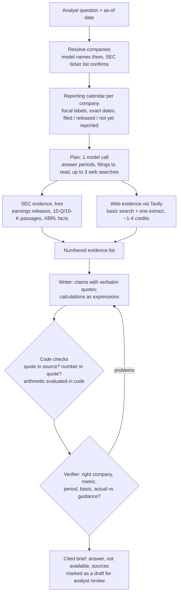

# Cited financial research agent (Tavily + SEC EDGAR)

An agent that answers financial analysts' questions about SEC-reporting companies:
- **What it answers:** reported results, calculations over them, guidance and management commentary, and recent developments.
- **How it answers:** every number is quoted from a primary source or computed in code, every claim is verified, and requests it can't answer are refused explicitly.

It replaces the starter agent, a LangChain agent with one Tavily search tool, with a fixed pipeline modeled on production finance agents.

> **Results:** see [Results](#results). Final numbers are filled in from `results/` after the end-to-end runs.

## Why this design

Production finance agents agree on a few patterns, and the starter agent follows none of them:
- **Structured, licensed data first.** In Daloopa's benchmark, adding structured data took agents from 20–71% accuracy with web search alone to about 90%.
- **Fiscal periods resolved explicitly.** Fiscal vs. calendar period confusion caused 63% of the best model's errors in Daloopa's benchmark.
- **Verifier pass before answering.** OpenAI's `financial_research_agent`, Bloomberg ASKB and Anthropic's citation agent all check claims against sources first.

The starter agent searched the web for everything, didn't know today's date, and computed numbers in its head. On our dev set:
- **Correctness:** 11–13 of 25 fixed-answer questions fully correct across three runs.
- **Sources:** only about 20% of the links it cited were primary sources.
- **Support:** only 51–75% of its cited claims were supported by the text it had retrieved.

## Architecture



| Step | Module | What it does |
|---|---|---|
| Resolve | `agents/company.py` | The model names the companies and code resolves them against SEC's ticker list. Private or ambiguous names stay unresolved; nothing is guessed. |
| Calendar | `agents/fiscal.py` | Each company's periods come from its own filings: fiscal labels (naming convention taken from its annual-report XBRL), exact start and end dates, and status: filed, earnings release only, or not yet reported. |
| Plan | `agents/planner.py` | One model call picks the answer periods, the filings to read and any web searches. Code drops anything that isn't in the calendar. |
| Evidence | `agents/research.py` | Fetches SEC filings (BM25-ranked passages from releases and 10-Q/10-K filings, plus exact XBRL facts), then runs Tavily basic searches and one query-focused extract for what filings can't give: news, call commentary, private companies. Social-media sites are excluded. |
| Write and verify | `agents/writer.py` | Claims must quote their sources verbatim. Code rejects quotes that aren't in the source and numbers that aren't in a quote, and evaluates calculations itself. A verifier call checks meaning. One revision is allowed; claims that still fail are withheld. |
| Orchestrate | `agents/pipeline.py` | Runs the steps, renders the brief and provides the CLI. |

Every step is traced in Langfuse through OpenTelemetry (`agents/tracing.py`): one trace per question, with model calls, Tavily calls, and the eval scores attached.

## Scope

**In scope:** questions about companies that file with the SEC, covering:
- figures in their filings and earnings releases
- calculations over those figures (growth, margins, TTM, implied quarters)
- company guidance and beat/miss against it
- management-stated drivers
- recent developments

**Answered with an explicit refusal:**
- periods not yet reported as of the question date
- metrics the company doesn't disclose
- companies that don't file with the SEC (it may cite their own published figures, labeled as such)

**Out of scope:**
- licensed data (estimates, consensus, transcripts behind paywalls)
- real-time prices
- portfolio advice

## Evaluation

- **Dev set:** `evals/golden.jsonl`, 30 questions covering the 9 task categories of the Vals AI Finance Agent benchmark and the known failure modes: fiscal periods, units, wrong entity, GAAP vs. non-GAAP, stale data and refusals. The user verified every reference answer. This set was inspected during development.
- **Held-out set:** `evals/test_heldout.jsonl`, 20 questions about 21 different companies. It was built by a research subagent from SEC filings and checked against XBRL data. Its hash was recorded and committed before the agent ever ran on it (`evals/test_heldout_manifest.json`), and no agent code changed in response to its results.
- **Same model for both agents:** the baseline (the starter's prompt, tool and agent loop) and the new agent both run on `deepseek-ai/DeepSeek-V4.1-Flash`, so the comparison measures architecture rather than model choice.
- **Judge:** `nvidia/Nemotron-3-Ultra-550b-a55b`, a different model family, grades correctness against each question's rubric and checks every cited claim against the text the agent actually retrieved. It agreed with the user's grades on 8 of 9 sample answers.

## Results

_To be filled from the final runs._

## Usage

```bash
cp .env.example .env    # then add TAVILY_API_KEY, NEBIUS_API_KEY, SEC_USER_AGENT (optional: LANGFUSE_*)
uv sync
uv run python scripts/check_env.py
uv run python -m agents.pipeline "What was Oracle's total remaining performance obligations at the end of Q1 FY2027?"
```

Evaluate:

```bash
uv run python -m evals.run run --agent agent --set test --name agent_test_r1
uv run python -m evals.run run --agent baseline --set test --name baseline_test_r1
uv run python -m evals.run compare baseline_test_r1 agent_test_r1
uv run pytest -q
```

## Limitations and what I didn't do

_To be completed with the final results._
