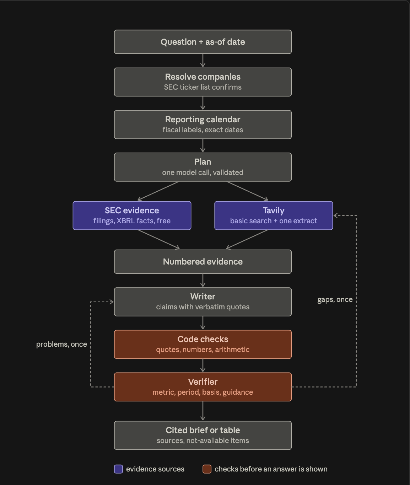

# Report: a cited financial research agent

**Live app:** [3-143-102-144.sslip.io](https://3-143-102-144.sslip.io) (shared-password sign-in)

**Build record:** the coding-agent session log (`SESSIONS.md`) is shared with the submission.

**Contents:** [Technical statement](#1-technical-statement) · [How this answers the brief](#2-how-this-answers-the-brief) · [Architecture](#3-architecture) · [Results](#4-results) · [Design decisions](#5-design-decisions-and-trade-offs) · [Evaluation method](#6-evaluation-method) · [How the result was reached](#7-how-the-result-was-reached) · [Limitations and next steps](#8-limitations-and-next-steps) · Appendices: [chat UI](#appendix-a-chat-ui), [deployment](#appendix-b-deployment), [commands](#appendix-c-commands)

## 1. Technical statement

**Why I built this.** I follow stocks and investment portfolios, and the hardest part of that is getting figures I can trust: the real reported number, for the right period, from a source I can check. A financial research agent that answers with credible, sourced information is something I would use myself, so I built for that user: someone researching public companies who can't afford a wrong number.

**What I saw in the starter.** Before building anything, I needed questions that reflect what analysts actually ask. I had a subagent take on the role of a financial analyst and write the questions it would want answered, grounded in published finance benchmarks (FinanceBench and the Vals AI Finance Agent benchmark), and I checked every fixed reference answer against the filings myself. That became my first test set, and the starter did poorly on it: 40 of 75 answers fully correct over three runs. It searched the web for everything, didn't know today's date and did arithmetic in its head. Later, on 50 harder held-out questions, it got 14 fully right, and a third of the claims it cited weren't backed by the source it cited. For a financial analyst that is worse than no tool at all, because every answer has to be checked by hand anyway, and a wrong number that slips through can end up in a model or a client note.

**Approach: why better search alone wasn't the fix.** The starter's problem wasn't finding information; it was that nothing it said could be trusted. Better search would give it more pages to paraphrase, not more reliable answers. What an analyst needs is the right company, the right fiscal period (many companies' years don't match the calendar), the exact reported figure, and a source they can click and verify. So I built around two questions: where does each number come from, and how do we know it's right before the analyst sees it?

**Why SEC filings first, and Tavily for the rest.** The figures analysts care about most are already published, exactly and for free, in companies' SEC filings. Paying to search the web for them, and then citing a news article that paraphrased them, felt backwards. So the agent reads filings first, and Tavily does what only search can do: what management said on the earnings call, a deal announced last week, results from companies that don't file with the SEC. I didn't assume the most expensive search settings were best; I measured them. Basic search plus one focused extract beat advanced depth, the finance topic and automatic parameters, and cost less.

**Thought process: how I worked.** I measured the baseline before building anything, including the starter on the model I planned to use. That alone took it from 14 to 25 correct, which told me how much a better model contributes and how much has to come from the design. The first thing I built was a planner, together with company resolution and each company's reporting calendar: before fetching anything, the agent works out which company is meant, which fiscal periods answer the question, and which filings and searches it needs. Many analyst questions hinge on fiscal periods (18 of the 30 in that first set test fiscal-versus-calendar confusion), so getting the company and the period right came first. From there I added the rest one step at a time, and every step had to earn its place by preventing a mistake I'd actually seen: the wrong company, the wrong period, an invented number, or the right number with the wrong meaning (net sales reported as revenue, guidance reported as actual results). I planned the work as milestones, each with a test it had to pass, and kept a separate set of test questions that I never used while building.

That discipline mattered most when it was uncomfortable. My first version scored 21 of 25 on the practice questions, which looked great until I saw it had been tuned to those exact questions and swung between 11 and 21 from run to run. I threw it out and rebuilt it to work in general. It was the most important decision in the project.

**What I traded off.** Answers take 45 seconds against the starter's 26, because writing with exact quotes and checking every claim takes time. I accepted that because an analyst would rather wait than re-check, but I still halved the response time by tuning how hard the model thinks at each step, and treated search credits as a real budget.

**Technical value.** The agent's answers can be checked, and they hold up when checked. On the same 50 questions, 94% of its cited claims are backed by the source they cite (against 66% for the starter), 73% of its citations are official SEC or company sources (against 15%), and 18 answers are fully correct with every claim and number sourced (against 2). When a question is unclear or incomplete, it asks, declines, or says how it read the question instead of guessing, and handled 11 of 16 such questions against the starter's 1.

**Business value.** An analyst's time goes into re-checking, so an answer that doesn't need re-checking is where the saving comes from. Every figure traces to a filing or company release and nothing unsupported is shown, which lowers the risk of a wrong number reaching a model or a client. It also costs less to run: $0.049 per question against $0.126, using a third of the search credits. And it is ready to operate: every step is traced for debugging, and the app tests and redeploys itself on each update.

**Where it falls short.** It is weakest on questions that depend on the web: 3 of 10, against 7 for the starter's design on the same model. Next I'd improve web coverage, make the checking faster, and add licensed data such as analyst consensus.

**Glossary**

| Term | Meaning |
|---|---|
| SEC filing | A report US-listed companies must file with the regulator: annual (10-K), quarterly (10-Q) or event (8-K). |
| XBRL | The machine-readable data inside filings, which gives exact figures for each reporting period. |
| Fiscal period | A company's own reporting year or quarter, which may not match the calendar. |
| Primary source | The company's own filing or release, rather than news or a data site. |
| Held-out questions | Test questions kept apart and never used while building, so results aren't flattering. |
| Exact50 | The 50 held-out questions used for the headline results (§4). |
| Verified-correct | Fully correct, with every cited claim backed by its source and every number cited. |
| Tavily credit | The unit Tavily bills web searches in (about $0.008 each, pay-as-you-go). |

## 2. How this answers the brief

The brief suggested a few directions for improving the starter. Here's how I took each one.

**Adapt it to a specific customer workflow.** I built it for one user: a financial analyst researching US-listed companies. It answers what they actually ask about (reported results, calculations like growth and margins, guidance and recent developments) and builds the comps and trend tables they make every day. It's just as clear about what it won't do: periods not yet reported, undisclosed metrics, investment advice. And the chat lets them ask follow-ups or pick an as-of date for point-in-time questions.

**Add a useful integration.** I connected the agent directly to SEC EDGAR, the regulator's own database of company filings. It's the official source for reported numbers, it's free, and the data is structured. I call SEC's own APIs through a small client of my own instead of a third-party wrapper.

**Improve retrieval quality.** The agent reads SEC filings first: the most relevant passages, ranked, plus the exact XBRL figures for each period. Tavily is used only for what filings lack, with basic search plus one focused extract, the cheapest setup and the one that scored best when I measured it. It keeps only results about the right company, and searches companies' own sites first when they don't file with the SEC. Tavily responses are cached, so I could replay runs at zero credits while developing.

**Improve source handling and citations.** Every claim has to quote its source word for word. Code checks that each quote really is in that source and that every number appears in a quote, and it does all the arithmetic itself rather than trusting the model. A verifier then checks the meaning, such as the right metric, period and basis. Every statement that survives gets an `[n]` citation marked as a primary or secondary source.

**Add an evaluation loop.** I kept practice questions separate from test questions, and each test set was frozen before the agent ever saw it. Answers are graded by a model from a different family, point by point against a rubric, with code deciding the final verdict, and every citation is checked against its source. The same harness runs the starter and my agent, so the comparison is fair. A unit test also fails if any test company's name shows up in the agent's code.

**Introduce a context engineering improvement.** Instead of handing the model a question and a pile of search results, I control what it sees. It gets the company's real reporting calendar and today's date, then plans what to read before anything is fetched, and code removes any period that hasn't been reported. The writer works from ranked, numbered evidence, and each step thinks only as hard as it needs to (none, low, medium or high reasoning effort).

**Improve observability/debuggability.** Every question becomes one trace in Langfuse, built on OpenTelemetry. It has a step for each part of the pipeline, every model call with its tokens and cost, and every Tavily call with the credits spent and the results returned. Evaluation scores are attached to each trace, so I could go from a failing answer straight to the step that broke it.

**What I'd add next.** Today, finding which step or model call caused a wrong answer means reading its trace. The next step would be flagging that automatically, so failures are grouped by cause without opening each trace.

## 3. Architecture



A question and as-of date go through company resolution, the reporting calendar and one planning call; SEC evidence and Tavily feed numbered evidence; the writer quotes sources verbatim; code checks and a verifier run before the cited brief or table is shown. The verifier can send problems back to the writer once and evidence gaps back to Tavily once.

| Step | What it does | Why it's there |
|---|---|---|
| **Resolve** (`agents/company.py`) | The model names the companies; code resolves them against SEC's ticker list. Private or ambiguous names stay unresolved, and a question with no reasonable reading gets one clarifying question. | **Wrong-entity errors** (Facebook vs. Meta, share classes, spin-offs). The model can never invent an identifier. |
| **Calendar** (`agents/fiscal.py`) | Builds each company's reporting periods from its own filings: fiscal labels (naming convention read from its annual-report XBRL), exact dates including irregular quarters such as 12/12/12/16 weeks, and reporting status as of the question date. | **Fiscal-period errors:** confusing fiscal and calendar periods caused 63% of the best model's errors in Daloopa's benchmark. Reporting status drives both refusals and point-in-time answers. |
| **Plan** (`agents/planner.py`) | One call works out exactly what is asked, where each piece is disclosed and what could make the obvious answer wrong as of today. It picks the answer periods, the filings to read and at most 3 web searches; code drops anything not in the calendar. | Scales effort to the question (Anthropic's guidance; OpenAI's `financial_research_agent`), and can't pick a period the company hasn't reported. |
| **SEC evidence** (`agents/research.py`) | Ranked passages from earnings releases, 10-Q/10-K filings and recent 8-Ks, plus XBRL facts for every answer period, with core income-statement lines always included. A filing not yet in SEC's tagged data is read directly. | Primary, exact numbers at no cost. In Daloopa's benchmark, structured filings data took agents from 20–71% accuracy to about 90%. |
| **Tavily evidence** (`agents/research.py`) | Basic search plus one query-focused extract, with social media excluded; a result must be about the company. Companies without quarterly SEC reports have their own sites searched first. One gap-filling round runs if the writer reports something missing. | News, earnings-call guidance and companies that don't file with the SEC. Added after dev failures where guidance existed only on the call. Settings were measured (§5). |
| **Write** (`agents/writer.py`) | The writer works through the question first, then writes claims and table cells that must quote their sources verbatim. Code rejects any quote not in its source and any number not in a quote, and evaluates calculations itself, chained where one result feeds another (fiscal Q4 = full year minus nine months). | **Invented or mis-computed numbers.** Arithmetic is never left to the model. |
| **Verify** (`agents/writer.py`) | A verifier checks meaning: company, metric, period, basis, actual vs. guidance. One revision is allowed; anything that still fails is withheld. | **Meaning errors code can't see** (net sales vs. revenue, GAAP vs. non-GAAP). Follows OpenAI's verifier pattern and Bloomberg's post-generation checks. |
| **Orchestrate** (`agents/pipeline.py`) | Runs the steps, renders the brief or table and provides the CLI. | One entry point shared by the CLI, the chat UI and the eval harness, so what is evaluated is what users get. |
| **Follow-ups** (`agents/followup.py`) | In the chat, one call rewrites a follow-up (or a reply to a clarifying question) into a standalone question. It never answers. | Lets analysts converse without changing the checked pipeline. |
| **Trace** (`agents/tracing.py`) | OpenTelemetry over OTLP (Langfuse by default; `TRACING=off` disables it): one trace per question, with a span for each step, model call (tokens and cost) and Tavily call (live or cached, credits, result URLs). Eval scores are attached. | Every run is inspectable step by step. The traces located the failures fixed in §7 and show where time goes. |

**Models**

| Use | Model | Why |
|---|---|---|
| Every agent step | DeepSeek V4.1 Flash (Nebius) | Stronger, faster and cheaper than the starter's Kimi K2.6: 39 against 27 on the Artificial Analysis Intelligence Index, 214 against 71 output tokens/s, $0.30/$1.20 against $0.95/$4.00 per million tokens. Reasoning effort is set per step: none for listing a company's web domains; low for resolving companies, rewriting follow-ups and verifying; medium for planning; high for writing and revising. |
| Grading evaluations | GPT-6 Luna (OpenAI, high reasoning) | A different model family from the agent, so no model grades its own kind; it agreed with my hand grades on 8 of 10 answers. GLM-5.3-Flash on Nebius was tried first and dropped after throttling. |
| Baselines | Kimi K2.6, and DeepSeek V4.1 Flash | The starter exactly as shipped, and the starter's design on our model, to separate the model's contribution from the architecture's. |

**Scope**
- **In scope:** SEC-reporting companies, covering figures in filings and earnings releases, calculations (growth, margins, TTM, implied quarters), guidance and beat/miss, management-stated drivers, recent developments, and multi-company and multi-period tables.
- **Refused explicitly:** periods not yet reported as of the question date, undisclosed metrics, and non-SEC companies (their own published figures may be cited, labeled as such).
- **Out of scope:** licensed data (estimates, consensus, paywalled transcripts), real-time prices and investment advice.

All production code is generic: a unit test fails if any evaluation-set company name appears in `agents/`.

## 4. Results

**Exact50** is 50 of the 74 held-out questions, chosen by fixed rules (`evals/exact50_selection.md`): all 16 edge-case and ambiguous requests, all 10 web-dependent questions, 16 date traps, 4 actual-versus-guidance questions and 4 cross-calendar comparisons. Plain single-figure lookups were dropped, because every configuration answers them. Each column is one fresh run of all 50, graded by GPT-6 Luna with three votes per answer. The middle column runs the starter's prompt, Tavily tool and agent loop on our model, which separates what the architecture contributes from what the model contributes.

| Measure | Starter as shipped (Kimi K2.6) | Starter design on our model | **Our agent** |
|---|---|---|---|
| Fully correct | 14/50 | 25/50 | **32/50** |
| Mean rubric score | 0.66 | 0.80 | **0.89** |
| **Verified-correct** | 2/50 | 0/50 | **18/50** |
| Cited claims supported by the cited source | 66% | 69% | **94%** |
| Cited sources that are primary (SEC or company) | 15% | 26% | **73%** |
| Tavily credits (all 50 questions)\* | 373 | 338 | **115** |
| Cost per question (model + Tavily)\*\* | $0.126 | $0.074 | **$0.049** |
| Tokens per question | 58k | 60k | 63k |
| Median latency | 26 s | **12 s** | 45 s |

| Fully correct, by question class | Starter as shipped | Starter design on our model | **Our agent** |
|---|---|---|---|
| Edge and ambiguous (16) | 1 | 1 | **11** |
| Traps: point-in-time, superseded, unreported, deregistered (16) | 6 | **10** | **10** |
| Web-dependent (10) | 3 | **7** | 3 |
| Actual versus guidance (4) | 3 | 3 | **4** |
| Comparisons across fiscal calendars (4) | 1 | **4** | **4** |

\* Our agent's credits are Tavily's reported usage. The starters' are counted from their successful searches, because the starter's LangChain tool doesn't report usage.
\*\* Model tokens at Nebius list prices (`agents/pricing.py`) plus Tavily credits at the $0.008 pay-as-you-go rate.

**What this shows: trust and cost, paid for in speed.** When a wrong number is expensive, an analyst would rather wait 45 seconds for an answer they don't have to re-check.
- **Against the starter as shipped:** fully correct rises from 14 to 32 and verified-correct from 2 to 18; supported citations rise from 66% to 94% and primary sources from 15% to 73%; it uses about a third of the credits and costs $0.049 per question against $0.126. The price is latency: 45 s against 26 s.
- **Against the starter's design on the same model:** fully correct rises from 25 to 32, mostly on ambiguous and edge-case requests (11 against 1 of 16); verified-correct is 18 against none; it uses a third of the credits. It is weaker on web-dependent questions (3 against 7 of 10) and about 4× slower.
- **Where the time goes:** Langfuse step timings on 29 of the final run's traces put most of it in writing and verification (median 24 s). The planner takes 5 s, company resolution 3 s, Tavily 6 s and SEC retrieval under 1 s.

**Why Exact50 is hard.**
- **"pt for crwd by yr end":** a terse request for a price target, which the tool should decline. Both starter configurations failed it; ours passed.
- **"tsla q3 deliveries and q3 net income":** deliveries were public, but Q3 net income wasn't reported yet as of the question date. The answer has to give one part and decline the other, not invent it. Both starters failed; ours passed.
- **Paychex's "current" fiscal 2027 outlook:** the June outlook was raised in September, so stopping at the first release returns superseded guidance. The starter as shipped got partial credit.
- **A trailing-twelve-month comp for four restaurant chains:** Darden's latest quarter is fiscal Q1 2027, not its fiscal 2026 annual report, and each company's quarter must be mapped separately. The starter as shipped failed it.

**Where search made the difference.** Exact50's web-dependent questions can't be answered from SEC filings. The final agent got Nintendo's quarterly results right (Nintendo doesn't file with the SEC), as well as the terms of the Nielsen–DoubleVerify deal and of Akamai's agreement with Anthropic. The starter's design on our model also answered these three correctly; the point is that search is how such questions get answered at all.

**How to read these numbers.**
- One run per column: with 50 questions, differences of two or three answers are within run-to-run variation.
- The questions, references and rubrics come unchanged from the held-out sets, but Exact50's selection rules were written with earlier results on those sets known, and held-out failures informed the agent's generic fixes (§7). So this is a discriminating benchmark, not a blind test.

Full tables and per-question verdicts: [`results/final/exact50.md`](results/final/exact50.md). The earlier full held-out results (older agent, Nemotron judge, before the grading fixes) are in [`results/final/results.md`](results/final/results.md). Their citation check also saw quotes attached to sources that didn't contain them, which may have flattered our agent's supported-claim rate there; the Exact50 grading strips them. On those mostly single-figure questions, the starter's design on our model was about as accurate as our agent (94% against 99% fully correct), and the architecture's gain was in trust and cost.

## 5. Design decisions and trade-offs

- **The model is the cheapest big upgrade.** Moving the starter's own design from Kimi K2.6 to DeepSeek V4.1 Flash raised it from 14 to 25 of 50 on Exact50 and cut median latency from 26 s to 12 s. With reasoning this cheap, what the model is shown (the context) is where the remaining gains are, which is what the pipeline works on.
- **Source quality and cost over speed.** Latency is 45 s median, mostly in writing and verification (§4). For factual research, a checked answer is worth the wait.
- **Tavily settings were measured, not guessed.** On the 10 web dev questions, with the research plans replayed so only search settings differed:

  | Setting | Correct | Credits per question |
  |---|---|---|
  | **basic search + one query-focused extract (kept)** | **8/10** | **3.9** |
  | advanced depth | 7/10 | 5.6 |
  | company sites first | 6/10 (64% primary sources) | 6.4 |
  | `topic="finance"` | 4/10 | 6.6 |
  | `auto_parameters` | 2/10 | 8.0 |

  The expensive settings didn't help. Company sites first is used only where it pays: companies without quarterly SEC reports. (Older agent, Nemotron judge, small sample.)
- **Credits were treated as part of the scope.** Most development runs had web search off or replayed cached Tavily responses (`--web-cache-from`) at zero credits; live credits went mainly to final and baseline runs. Saved research plans can be replayed so experiments differ only in what they test.
- **Kept simple on purpose.** Reasoning effort is fixed per step, which halved median latency without changing dev quality. A per-question effort selector using Jev (a new decision model) was tried on a branch and not merged. A multi-agent supervisor and Tavily `/research` were skipped too (§8).
- **A different model family judges.** The agents run on DeepSeek. Early runs were graded by NVIDIA's Nemotron. GLM-5.3-Flash on Nebius was the first choice for Exact50, but it was throttled in the first smoke runs (no grade for 5 of 24 answers), so Exact50 was graded by OpenAI's GPT-6 Luna.
- **Built to be run, not just demoed.** GitHub Actions tests every push, and `main` deploys itself to AWS, so it is always live. Work was tracked on a kanban board, and later work went through pull requests. The chat sits behind a shared password and answers one question at a time, to prevent abuse.
- **Secrets never passed through the coding agent.** Claude Code was instructed never to read `.env` (see `CLAUDE.md`). Keys are loaded only in code, and a one-off script copies them into AWS SSM Parameter Store without printing them. They never enter the image, Terraform state or GitHub.

## 6. Evaluation method

| Set | Contents | Role |
|---|---|---|
| `evals/golden.jsonl` | 30 questions across the Vals AI Finance Agent task categories and the known failure modes (fiscal periods, units, wrong entity, GAAP vs. non-GAAP, stale data, refusals); references verified by hand | Dev |
| `evals/dev_tables.jsonl`, `evals/edge_dev.jsonl`, `evals/web_dev.jsonl` | 3 table tasks, 24 ambiguous or edge-case requests, 10 web-dependent questions | Dev |
| `evals/test_heldout.jsonl` | 20 questions, 21 companies not used in development | Held-out |
| `evals/test_hard.jsonl` | 20 questions: point-in-time, filing-only figures for mid- and small-caps, multi-step fiscal calculations, traps, guidance vs. actual | Held-out |
| `evals/test_tables.jsonl` | 8 analyst table tasks (peer comps across fiscal calendars, 8-quarter trend with derived Q4, TTM and balance-sheet comps, segments), 86 cells | Held-out |
| `evals/test_edge.jsonl` | 16 ambiguous or incomplete requests (missing period or company, shorthand, share classes, out-of-scope asks, unreported periods, private companies) | Held-out |
| `evals/test_web.jsonl` | 10 questions whose facts aren't in SEC filings (call commentary, recent events, foreign issuers, private companies, multi-hop) | Held-out |
| `evals/exact50.jsonl` | 50 of the 74 held-out questions, chosen by fixed rules (`evals/exact50_selection.md`) | **Benchmark** |

**How the held-out sets were built**
- **Built blind:** each set was built by a research subagent from primary sources, without seeing either agent's outputs.
- **Checked:** references were cross-checked against SEC XBRL data where possible.
- **Frozen:** each set's hash was committed before the first run on it (`*_manifest.json`).

**How answers are graded** (`evals/scorers.py`)
- **Rubric judge:** GPT-6 Luna grades each answer against its question's rubric, three times; the median verdict counts.
- **Verdict from the rubric points:** the judge marks each requirement met or not met, and code derives the verdict. Optional items never block "correct", and fail conditions are phrased as what the answer must avoid.
- **Tables cell by cell:** the judge only extracts each cell's value; code compares it to the reference within tolerance.
- **Citation check:** every claim an answer makes about a company or source is checked against the source it cites. The judge sees each cited source in full (up to 30,000 characters), chosen the same way for every agent.
- **No self-grading:** the judge is a different model family from both agents.
- **Guard test:** `tests/test_agent.py` fails if any evaluation-set company name appears in `agents/`.

## 7. How the result was reached

1. **A first implementation was rebuilt.** It reached 21/25 on the dev set but was overfit: named-company rules and one prompt rule per test question. It was also unstable, ranging from 11 to 21 out of 25 across runs. It was replaced by the generic pipeline above, about 1,400 lines instead of about 5,700.
2. **Two more held-out sets were added.** On the first held-out set, the starter's design on our model and our agent both scored near the ceiling, so I added the harder set and the table set to test where the architecture matters. They were built blind from SEC filings, without seeing either agent's outputs.
3. **The as-shipped starter is the headline baseline.** It was run on the held-out sets once the comparison was framed as "what was shipped vs. what we built". The same-model runs stay as the architecture-only comparison.
4. **Changes came only from dev failures, until the review.** Until 2026-10-05, agent changes were driven by dev-set failures only. Two known held-out issues remain unfixed and are reported: a unit mismatch in one table calculation, and an over-strict verifier rule.
5. **Budget.** Most of the Tavily credits went to the starter runs, which is why the as-shipped starter has two runs on held-out sets 1 and 2 and none on the table set. Tavily's usage endpoint reported 1,884 credits used against the 1,500-credit plan; the 384 over were billed pay-as-you-go.
6. **The evaluation was reviewed (2026-10-05).** A full rerun looked wrong: the starter's design on our model was ahead on correctness. The review found problems in the harness first:
   - answers scored 0 because the judge's verdict contradicted its own per-point marks
   - one run graded by the agents' own model
   - a citation check cut to the first 60,000 characters of everything retrieved, which hid support for long baseline retrievals
   - many questions that every configuration answers

   The grading was fixed (verdict from the required rubric points, cited sources shown in full), and Exact50 was built from the held-out sets by rules written down first.
7. **Generic fixes from the diagnosis.** The run records and Langfuse traces showed where held-out answers broke:
   - a number check that read "Margin 29.4%" as a date
   - zero-width spaces in SEC tables breaking quote matching
   - SEC's tagged financial data lagging two companies' July 10-Qs
   - calculations that couldn't chain
   - web results about other companies passing the relevance filter

   These were fixed in code. The planner and writer prompts were rewritten to teach a way of working through a question rather than rules for particular questions, and the writer's reasoning effort was raised. That moved Exact50 from 24 to 32 fully correct.

## 8. Limitations and next steps

- **Web-dependent questions are the weakest class:** 3 of 10 on Exact50, against 7 for the starter's design on the same model. The answers often leave out details the rubric requires, or miss figures that only a company's own release gives.
- **Slower:** 45 s median latency against 12 s for the starter's design on the same model, mostly writing and verification.
- **Small samples:** one run per configuration, and 4 to 16 questions per class.
- **Simple lookups don't separate the designs:** Exact50 leaves out plain single-figure questions, which every configuration answers. It shows where the designs differ, not accuracy on simple lookups.
- **A known table bug:** a table calculation can come out in a different unit than its column (inputs in thousands under a "USD millions" column). A unit check per column would catch it.
- **Verifier strictness:** its "net sales is not revenue" rule can withhold a correct cell.
- **SEC filers first:** foreign issuers and private companies get only what the web and their own sites provide.
- **No licensed data:** no consensus, estimates or paywalled transcripts. Beat/miss checks use company guidance, not consensus.
- **Follow-up rewriting isn't evaluated:** the evaluation sets are single-turn. A wrong rewrite is visible as **Researched as** above the answer.
- **Skipped on purpose:** a multi-agent supervisor (research found it costs about 15× the tokens, and these tasks have known shapes); Tavily `/research` (it hides source tiers and claim-level checking); a vector database (evidence is fetched fresh for each question).

**Next steps:** faster verification, a per-column unit check for tables, better coverage of web-dependent questions, and licensed data for consensus estimates.

## Appendix A: Chat UI

A conversational front end built on [Chainlit](https://github.com/Chainlit/chainlit), an open-source chat UI for Python LLM apps. It's an optional dependency group, so the agent and eval environments don't change.

```bash
uv run --group ui python -m ui            # http://localhost:8000; Chainlit options pass through, e.g. --port 8001
```

- **Sign-in:** one shared password, read from `APP_PASSWORD` (`.env` locally, SSM Parameter Store when deployed); the name is optional. Without it, sign-in is refused.
- **Citations on every statement:** each claim, table cell and "not available" item ends with `[n]` markers. A marker links to its source, opened at the quoted passage where the browser can find it (URL text fragments). Hovering a marker shows the verbatim quote the statement relies on.
- **Linked sources at the end:** a numbered list gives each source's title, domain, date and whether it is primary (SEC or company) or secondary.
- **Evidence panel:** a side panel lists every source of the answer, with the quotes behind each statement and any calculation (both the inputs and the expression computed in code). Each answer has its own panel, newest first.
- **Progress steps:** while it runs, the chat shows each pipeline stage: companies identified (name, ticker, CIK), the research plan, filings read, web results, and statements verified or withheld.
- **Conversation:** follow-ups ("and the prior quarter?", "compare that with its closest peer") and replies to clarification questions are rewritten into a standalone question before research, shown as **Researched as**. A message that isn't a research request (thanks, a greeting) gets a short description of the tool instead.
- **Settings:** an as-of date for point-in-time questions, and a switch for live web search. With it off, the chat answers from SEC data and cached Tavily responses only, without spending credits.

**Look and feel.** The theme (`ui/public/theme.json`, `ui/public/brand.css`) follows the color palette in [Tavily's brand guidelines](https://www.tavily.com/brand): Off White and Black as the foundation, light by default, and Lavender as the accent. Lavender text on Off White falls short of WCAG AA contrast, so links are black with a lavender underline. Nothing is used that the project has no rights to: no Tavily logo, wordmark or brand mark (the app has its own name and mark), and no Suisse Int'l, the commercial typeface on tavily.com. Type is Inter and Geist Mono, both under the SIL Open Font License. The app's readme states that it is not affiliated with or endorsed by Tavily.

The UI calls `agents.pipeline.run` like the CLI and the eval harness do, so the answers are the ones that were evaluated. Conversations are kept for the session only.

## Appendix B: Deployment

The chat UI runs on one EC2 instance (t3.micro, `us-east-2`) in Docker, behind Caddy for HTTPS, at an `sslip.io` hostname of its Elastic IP: [3-143-102-144.sslip.io](https://3-143-102-144.sslip.io). The instance answers one question at a time.

- **CI** ([.github/workflows/ci-cd.yml](.github/workflows/ci-cd.yml)): every push runs the tests, checks the Terraform, builds the image and checks that it holds no `.env` file or API key.
- **CD (pull-based):** a push to `main` publishes the image to `ghcr.io/laasyaaprasad/financial-research-agent`. A systemd timer on the instance checks for a new image every 2 minutes and restarts the app when the image or the secrets change. GitHub has no AWS access.
- **Infrastructure:** [infra/main.tf](infra/main.tf) (Terraform, local state) creates the instance and its Elastic IP, a security group (ports 80 and 443 only, no SSH; SSM Session Manager instead) and the instance's IAM role.
- **Secrets:** API keys live only in `.env` and in SSM Parameter Store (SecureString) under `/fin-research-agent/`, which only the instance can read. [deploy/put_secrets.py](deploy/put_secrets.py) copies them from `.env` without printing them.

One-time setup, then push to `main`:

```bash
terraform -chdir=infra init
terraform -chdir=infra apply
uv run --with boto3 deploy/put_secrets.py
terraform -chdir=infra output -raw url
```

**Cost:** the t3.micro and 20 GB of gp3 storage are free-tier eligible; the public IPv4 address costs about $3.60 a month. To remove it, run `terraform -chdir=infra destroy`, then delete the `/fin-research-agent/*` parameters.

## Appendix C: Commands

```bash
uv run python -m evals.run suite --agents baseline,agent --sets exact50 --name my_suite   # both agents, one pool
uv run python -m evals.run run --agent agent --set exact50 --name my_run                  # one agent; sets: dev, test, hard, tables, edge, web, exact50, ...
uv run python -m evals.run compare my_suite_baseline_exact50 my_run
uv run python -m evals.report --exact50     # rebuild results/final/exact50.md
uv run --group ui pytest -q
uv run python scripts/check_secrets.py      # scan files for key material
```
